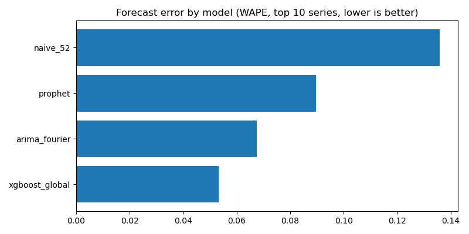
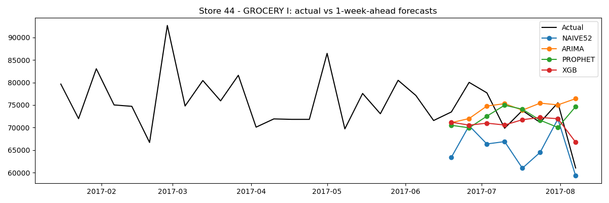
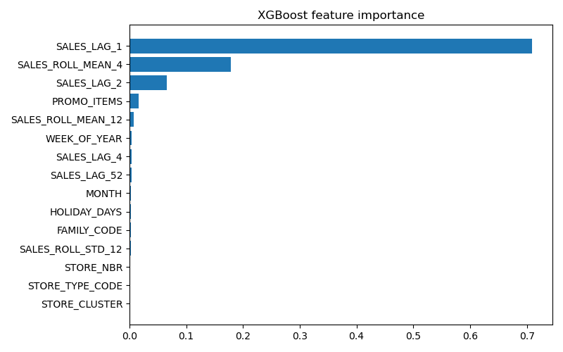

# Sales Forecasting & Insights Assistant

## Results

Models were evaluated with an 8-week rolling-origin backtest (1-week-ahead forecasts,
each trained only on prior weeks). Metric: WAPE (weighted absolute percentage error),
chosen over MAPE because many weeks have zero sales.

| Model | WAPE (top 10 series) | vs. baseline | WAPE (all 1,782 series) |
|---|---|---|---|
| Seasonal naive (same week last year) | 13.6% | — | 16.0% |
| Prophet (+ promotions, holidays) | 9.0% | -34% | — |
| ARIMA(1,1,1) + Fourier seasonality | 6.8% | -50% | — |
| **XGBoost, global model** | **5.3%** | **-61%** | **7.3% (-54%)** |

**Key takeaways**
- A single global XGBoost model outperformed per-series statistical models and scaled
  to all 1,782 store-category series without per-series tuning.
- Recent sales momentum (last week, 4-week average) drives 1-week-ahead accuracy;
  last year's value adds little because the business grew ~2.5x over the period.
- Oil price was excluded from forecasting models to avoid look-ahead leakage, since
  next week's price is unknown at forecast time.

